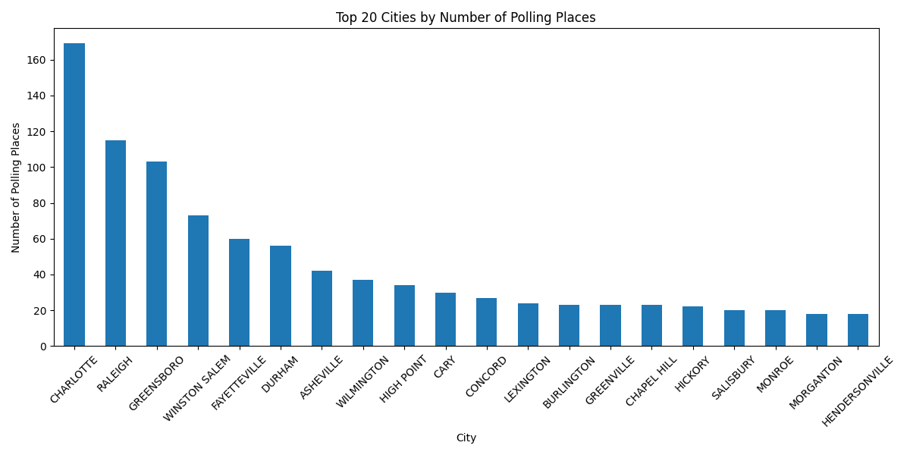
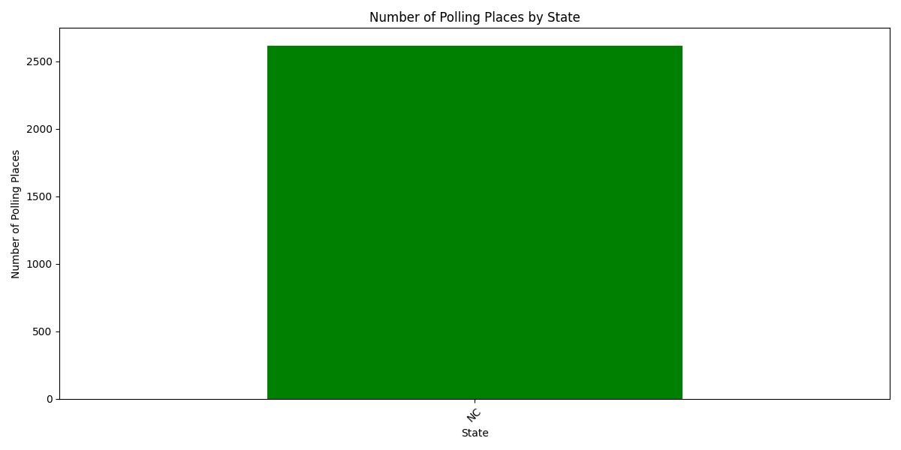
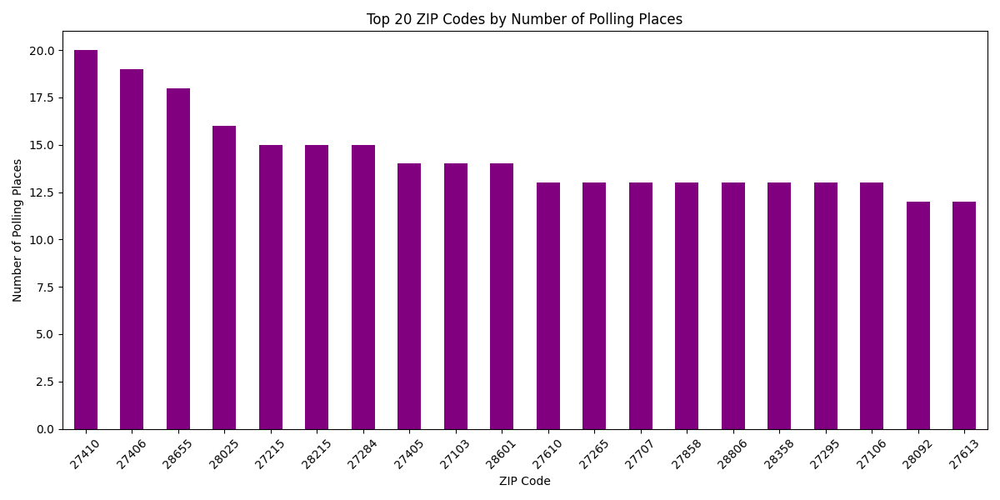

# Polling Places Analysis Report

## Descriptive Statistics

### Numeric Columns

|       |   polling_place_id |      zip |
|:------|-------------------:|---------:|
| count |          2616      |  2616    |
| mean  |            50.2554 | 27997.2  |
| std   |            52.5017 |   533.75 |
| min   |             1      | 27006    |
| 25%   |            13      | 27534    |
| 50%   |            32      | 28063    |
| 75%   |            65      | 28455    |
| max   |           239      | 28909    |

### Categorical Columns

|        | election_dt   | county_name   | polling_place_name                             | precinct_name   | street_address     | city      | state   |
|:-------|:--------------|:--------------|:-----------------------------------------------|:----------------|:-------------------|:----------|:--------|
| count  | 2616          | 2616          | 2616                                           | 2616            | 2616               | 2615      | 2616    |
| unique | 1             | 100           | 2498                                           | 2490            | 2429               | 620       | 1       |
| top    | 05/14/2024    | WAKE          | SAMPSON COUNTY AGRI-EXPO CENTER (CIVIC CENTER) | SALEM           | 1501 MOUNT ZION PL | CHARLOTTE | NC      |
| freq   | 2616          | 212           | 6                                              | 5               | 7                  | 169       | 2616    |

This section provides the summary statistics for both numeric and categorical columns in the dataset. The numeric columns provide insights into the distribution of the data, while the categorical columns reveal the distinct values for non-numeric data, such as city and state.

## Visualizations

### Top 20 Cities by Number of Polling Places

### Polling Places by State

### Top 20 ZIP Codes by Number of Polling Places

## Conclusion

From the data and visualizations, we can see that the majority of polling places are concentrated in a few major cities and states. The distribution by ZIP code also highlights areas with more significant polling place activity. Further analysis could include trends over time or comparisons with voter population data.
